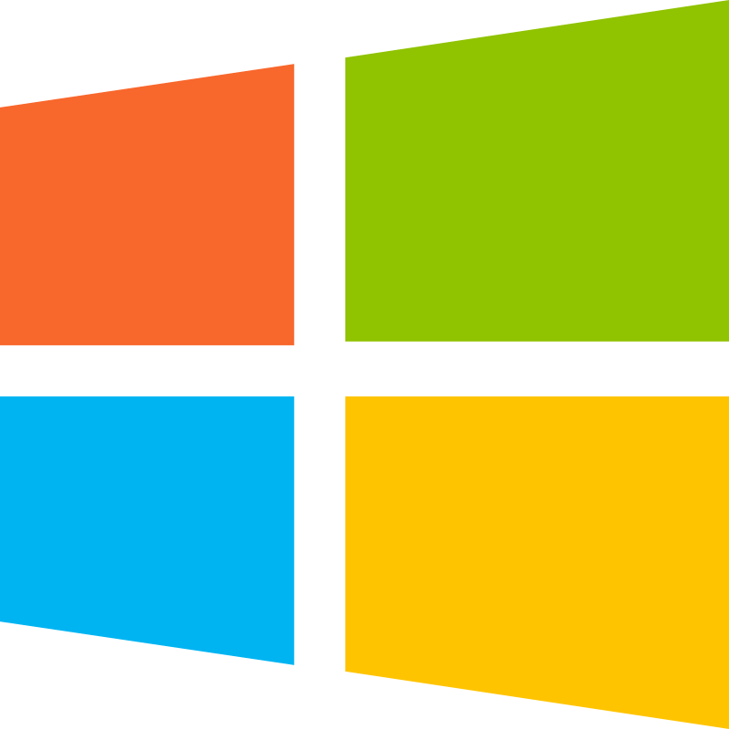

# tetris (CopBoat's Version)
(Place holder for gif)

Tetris built with C++ and SDL3! (sdl3 3.2.20-1, sdl3_image 3.2.4-1, sdl3_ttf 3.2.2-1)

## Features
- Implements the [Super Rotation System](https://tetris.wiki/Super_Rotation_System)
- Lock Delay of 30 frames (0.5 seconds) with 10 resets allocated for horizontal movement and 5 resets allocated for rotations
- Next imediate piece is displayed upon placement
- The current piece may be swaped for the hold piece once per placement
- Visual modification options for the board, pieces, and placement preivew
- Fullscreen toggle, small, standard, and large presets, as well as conventional click and drag can be used to resize the game window 
- Highscores and settings are preserved between play sessions
- Controller support (Tested with Xbox controller)

## Controls
Non-directional inputs can be rebound in the options menu

| Action | Keyboard | Controller |
| ------ | -------- | ---------- |
| Move Left | Left Arrow | DPad Left & Analog Stick Left|
| Move Right | Right Arrow | DPad Right & Analog Stick Right |
| Soft Drop | Down Arrow | DPad Down & Analog Stick Down |
| Rotate Clockwise | Up Arrow | X Button |
| Rotate Counter Clockwise | Left  CTRL | B Button |
| Hard Drop | Spacebar | A Button |
| Hold | H Key | LB Button |
| Pause | Escape | Start Button |
| Increase Level | L Key | Select Button |

## Save Data
Progress is saved to the file tetris_save.dat in the same directory as the executable. If the file does not exist when the game attempts to save, one will be created.

### Saving Game Progress
- High Score is saved and displayed in the bottom right corner during gameplay. 
- Highest Level reached is saved and pressing the L key or the Select button during gameplay will increase the level you are currently on. You may increase the level until it reaches the highest level recorded in your save file. 
- The game writes to tetris_save.dat when you return to the main menu or get a game over. 

### Saving Settings
- Game, Video, and Input options are all saved between sessions.
- The game writes your settings to tetris_save.dat when you exit the options menu.

You may reset your progress at any time by deleting tetris_save.dat, or moving it to another directory. 

## Installation
Grab one of the releases or compile it yourself with the instructions below!

<h3 align="center">Download</h3>

<table align="center">
  <tr>
    <td align="center" width="260">
      <br/>
      <strong><a href="https://github.com/username/repo/releases/latest/download/file.zip">Tetris for Windows</a></strong><br/>
      <sub>Standalone .exe release</sub>
    </td>
    <td align="center" width="260">
      <br/>
      <strong>Tetris for Linux</strong><br/>
      <sub>Coming soon</sub>
    </td>
  </tr>
</table>

## Resources
- [The Tetris Wiki](https://tetris.wiki/Tetris.wiki): Guidlines and general information
- [Lazy Foo' Productions SDL3 Tutorial Series](https://lazyfoo.net/tutorials/SDL3/index.php): A great series of lessons, to which he suggested creating tetris after completing. This project utilizes the LTexture and LTimer classes from his true type/animation lessons.

## Compilation
### 1. Clone the repository and navigate to the cloned folder:
```bash
git clone https://github.com/CopBoat/tetris.git
cd tetris
```

### 2. **For Arch/Manjaro or Ubuntu/Debian users**, simply run the automated build script:
```bash
./build.sh
```
### 3. **For other Linux distributions or Windows users** (via WSL/MSYS2):
Install dependencies first:

Windows (MSYS2 MinGW64 shell):

```bash
pacman -S --needed \
  mingw-w64-x86_64-toolchain \
  mingw-w64-x86_64-cmake \
  mingw-w64-x86_64-ninja \
  mingw-w64-x86_64-pkgconf \
  mingw-w64-x86_64-SDL3 \
  mingw-w64-x86_64-SDL3_image \
  mingw-w64-x86_64-SDL3_ttf
```

Other Linux distributions (install equivalent package names from your distro):

```bash
cmake
g++
ninja (or make)
pkg-config
SDL3
SDL3_image
SDL3_ttf
freetype
harfbuzz
```

Then in the project root, create a build folder:
  ```bash
  mkdir build
  cd build
  ```

- Use CMake to generate the build system for your platform (Linux, Windows, etc.):
  ```bash
  cmake ..
   ```
- Compile the project using the generated build system:
  ```bash
  cmake --build .
  ```

### 4. Enjoy your executable! All dependancies are embedded, so you can move the executable wherever you like 😁